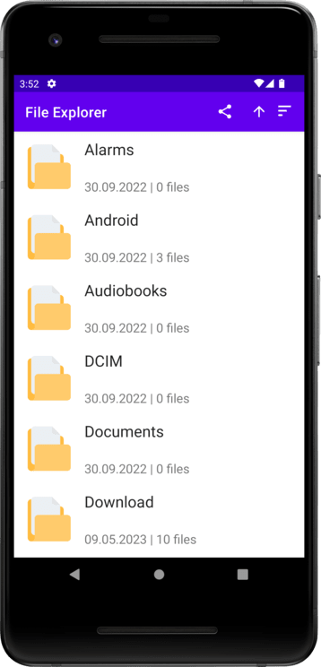

 

  <h1 align="center">Convenient File Explorer</h1>

  

    Share and open your files easily!
     
     
  

## About The Project
[--> Get fresh APK file here <--](FileExplorer.apk)

File explorer is an app that makes browsing and interaction with files easy!

This project was made especially for VK, russian leading IT company.

## Features

- Browse through files
- Sort them by their name, date, size, extension
- Share files
- Open files
- See recent changes with the blue dot near the file icon
- For better user experience, folders are **always** displayed first

## Built With

Android Studio, Data Binding, Fragment, Room Database, View Model, Kotlin language

## Authors

* **Timur Cheryapov** - *Amateur Android Developer, MSU student* - [Timur Cheryapov](https://github.com/Timur-Cheryapov) - *Built the whole Project*
